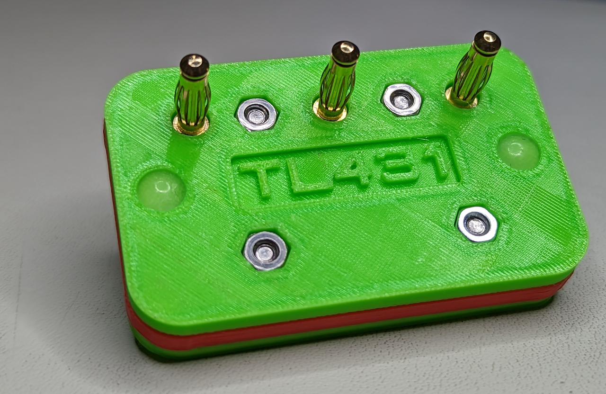

# TL431 Test Fixture Adapter for Tektronix Curve Tracers

Test fixture adapter for Tektronix curve tracers. Fits Tek 576, Tek 577 test fixtures, possibly others.

## Bill Of Materials

| Item | Qty | Source |
| --- | --- | --- |
| Prototype Board, 5x7mm, 0.1 in. hole pitch | 1 | [Amazon](https://www.amazon.com/gp/product/B07Y3PVDMZ "Amazon")|
| 4 mm RC-style banana plugs | 3 | [Amazon](https://www.amazon.com/gp/product/B07CSQH2QC "Amazon")|
| 6mm silicone rubber feet | 4 | [Amazon](https://www.amazon.com/HAWORTHS-Bumpers-Self-Adhesive-Hemispherical-Bumpons/dp/B06XX3192J "Amazon")
| M3x8mm button head socket screws | 4 |
| M3 nuts | 4 | 

## Tools

Drill Press*, 3/16" drill bit*, 3D printer, any rigid filament (PETG, PLA, ABS, etc.), soldering iron, hookup wire.

## Assembly

1. Print bottom, middle, and top pieces, as well as two jigs. Printing parameters: 0.6mm or smaller nozzle, layer height 0.3mm or lower.

STLs with "hires" in the name are containing fine details, the 0.25mm or smaller nozzle and 0.1mm or smaller layer height is recommended.

2. Using the drill jig find holes that can be used as pilots for 3mm screws on the prototype board, mark them, remove the jig, then drill 3mm holes where marked.

3. Screw the drill jig to the board, drill 3/16" holes for the banana plugs.

4. Mark the outer border of the board, cut the excess material. A drill jig can be used to make the clean edge.

5. Insert banana plugs as shown. Check the height protruding from the other side, should be 1mm*. A leveling jig can be used.

6. Insert* and solder the 3 pin header as shown. Connect the header pins to the banana plugs.

7. Assemble 3 printed pieces and PCB as shown.

